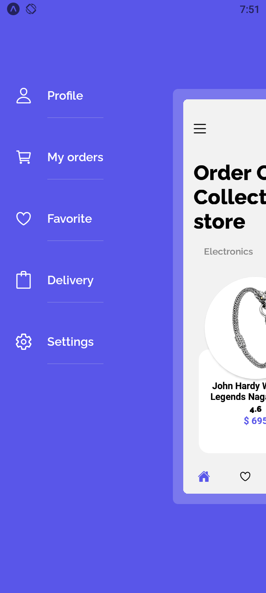
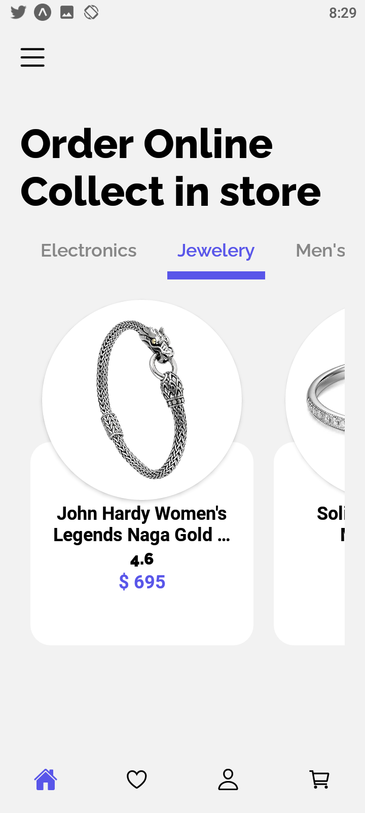

<div align="center">
  <h1> React Native E-Commerce App </h1> 
  <h2>Designed by <a href='https://www.figma.com/@rosina' >Rosina</a> </h2> <p><a href='https://www.figma.com/community/file/938370941255119298' >Figma Community Link</a> </p>
 <p>An Ecommerce app made with react native</p>
    
    
    
</div>
<br />
<br />
<br />

<!-- --------------Features and Todo's------------ -->
<h2>Features and Todo</h2>
&check; <a href="./src/navigation/BottomTabNavigator.tsx">Custom Screen animations </a> when drawer is opened. 
<br /> 
&check; Custom  <a href="./src/navigation/componets/DrawerContent.tsx">drawer component</a> for drawer navigator
<br/>
&cross; Add lottie animation for when a product is liked and added to cart
<br/>
&cross; Finish profile Screen
<br />
&cross; Finish cart Screen
<br />
&cross; Add firebase for authentication


<br/>
<br/>
<br/>
<!-- --------------Tools------------ -->
<h2>Tools</h2>
<table id="table" >
<tr>
<td>Animation</td>
<td><a href="https://docs.swmansion.com/react-native-reanimated/" >Reanimated 2</a></td>
</tr>
<tr>
<td>State Management</td>
<td><a href="http://redux-toolkit.js.org/">Redux Toolkit</a></td>
</tr>
<tr>
<td> API Request</td>
<td><a href="https://redux-toolkit.js.org/rtk-query/overview">RTK Query</a></td>
</tr>
</table>

<br/>
<br/>
<br/>

<h2>Contributing</h2>
Contributions are always welcome! 🙂
Have a look  at the "features and todo" section

<br/>
<br/>
<br/>

<!-- GETTING STARTED -->
## Getting Started
Get a local copy up and running.

### Prerequisites
<p>
Make sure you have <a href="https://reactnative.dev/docs/environment-setup"> react native development environment</a> set up in your system 

Install expo-cli
```sh
    npm install -g expo-cli
```
</a>

### Installation

1. Clone the repo
   ```sh
   git clone https://github.com/uwemneku/ecommerce-react-native-app.git
   ```
2. Install NPM packages
   ```sh
   npm install
   ```
   ```sh
   yarn
   ```

3. Start the App on expo
   ```sh
   expo start
   ```
